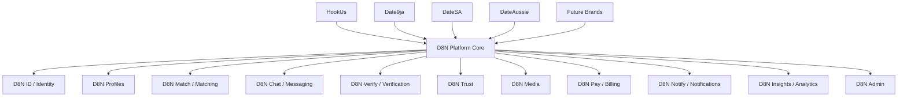
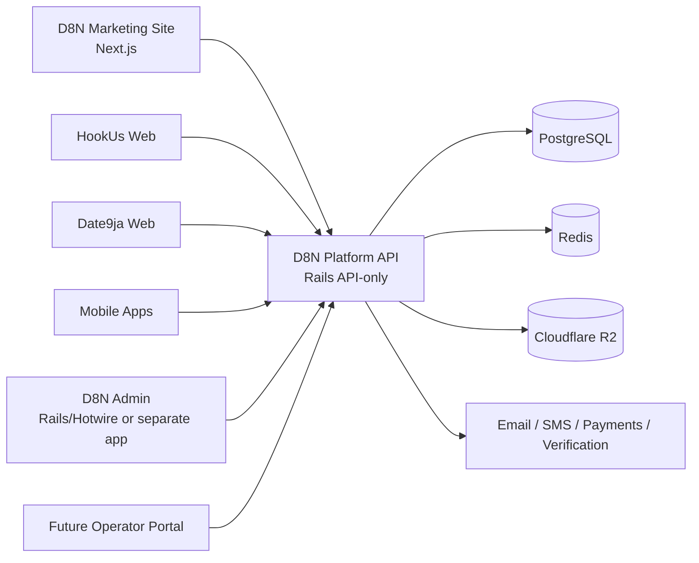
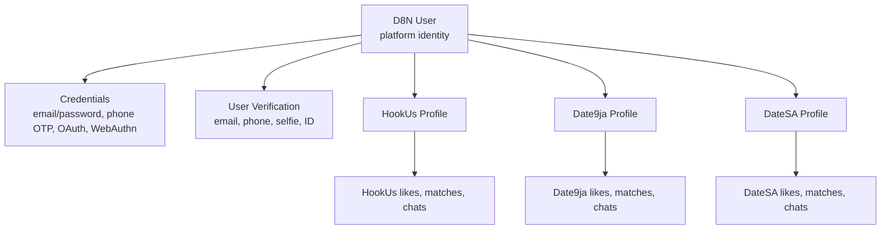
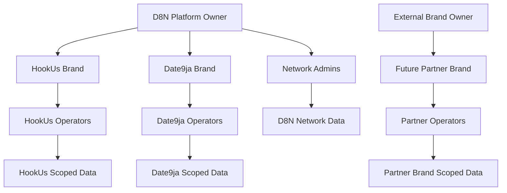
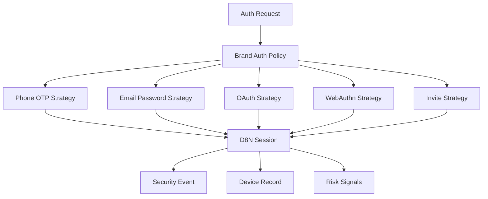
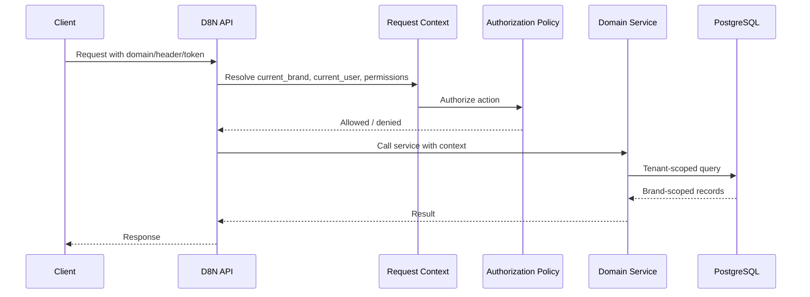
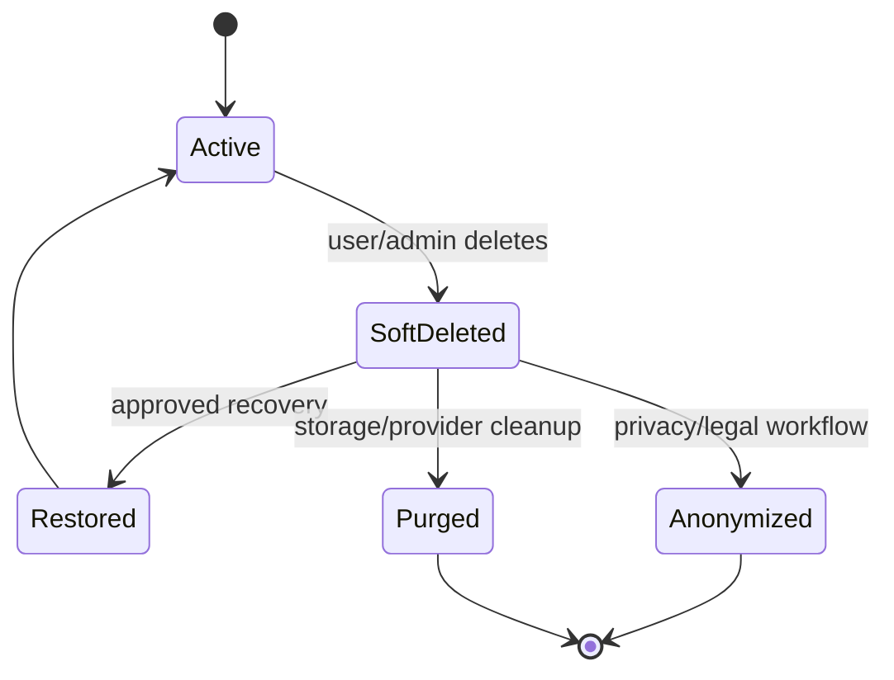
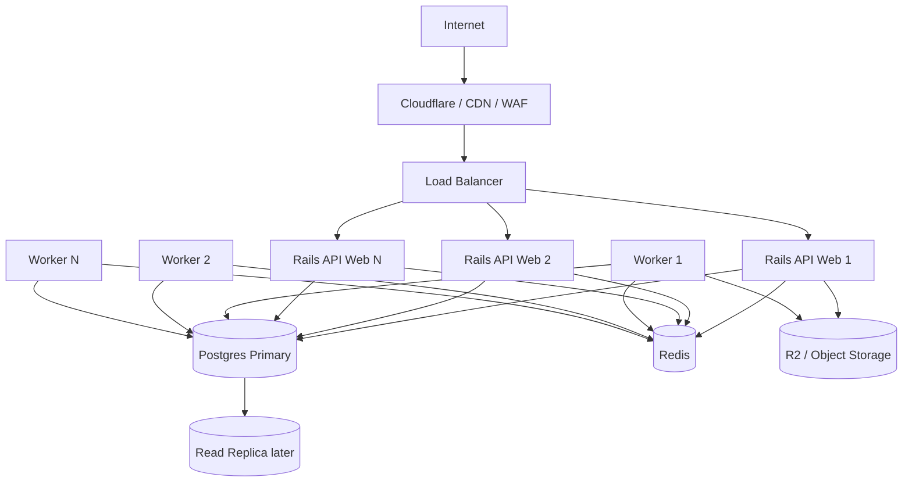

# D8N Architecture Diagrams

## Purpose

These diagrams are for founder, CTO, reviewer, investor, and future engineering discussions.

They use Mermaid so they can render in GitHub, VS Code, and many documentation tools.

## Platform Overview

## API-Only Core With Separate Frontends

## Identity Versus Brand Profiles

## Brand Ownership And Operators

## Auth Strategy Model

## Tenant-Safe Request Flow

## Soft Deletion And Recovery

## Scaling Shape

